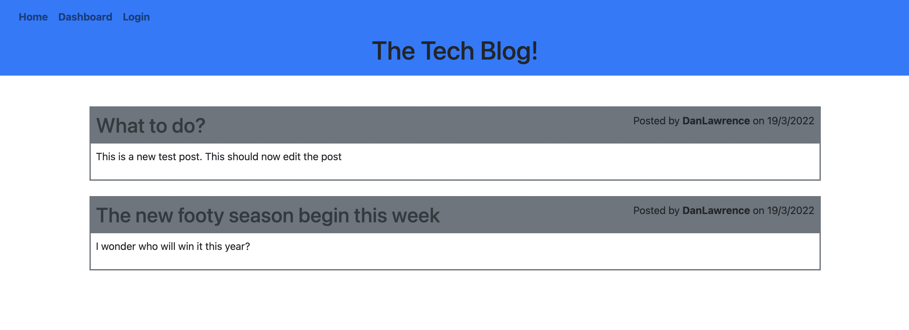
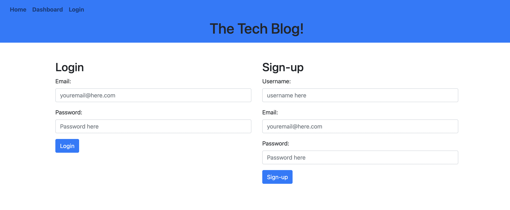
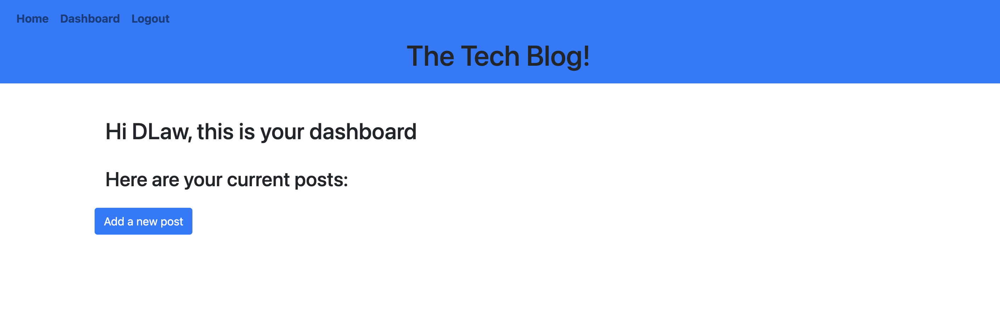
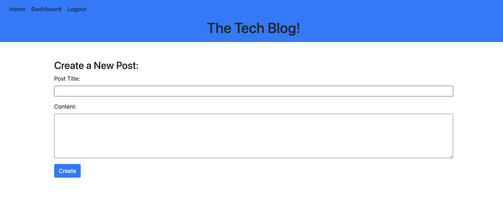
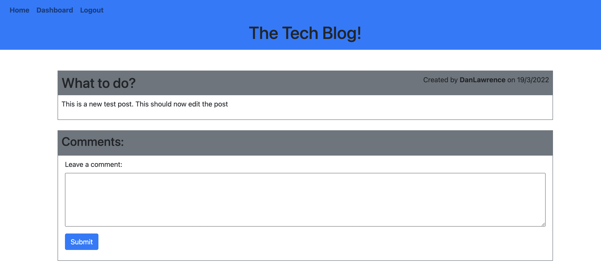
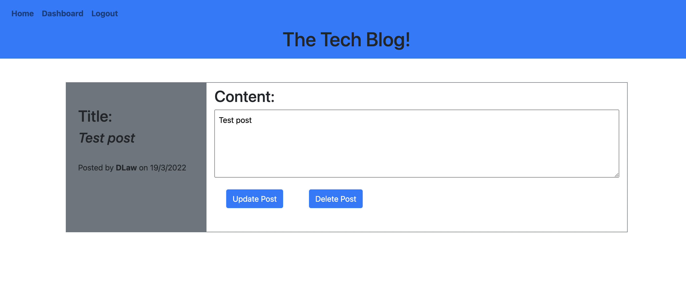

# Tech Blog

## Description

This is a working CMS-style blog with authentication for users to sign up and log in/log out. The site can only be edited once the user is signed up and logged in. Then they can create a new blog post, comment on other blog posts, as well as edit and delete their own blog posts.

## Installation

Clone the repo from github, and then run npm install to install the relevant dependencies. Once this has been done to run the project on local host, the database will need to be created through mysql shell and then the server can be started through running npm start. The project can also be accessed by the Heroku link [here](https://shielded-springs-19146.herokuapp.com/).

## Usage

This project can be used to create, edit and delete blog posts, as well as comment on other users blog posts. These actions can only be completed if the user has signed up and logged in, if they haven't logged in then they will only be able to see the homepage.

This project has created a front and back end for a blog website using handelbars as a template library to dynamically create the html for the website depending on the data in the database.

When the website first opens this is how it looks before logging in showing the nav bar and any current posts:

If any of the links are clicked and you are not signed in, the user is taken to the sign-in page:

You are then able to veiw the dashboard which will show any of your current posts (if there are any):

You can create a new post from the dashboard:

This can then be commented upoon:

If it is a post the user has written they can go back to the dashboard to edit the post, or delete it. If they view the post from the homepage they can comment on the post themselves:

## Questions

If there are any questions regarding this project please contact me through my email - dan.lawrence0810@gmail.com
Or please visit my GitHub profile which has further contact information - [DanLawrence91](https://github.com/DanLawrence91)
